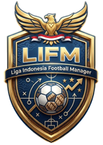

<div align="center">



# LIGA INDONESIA FOOTBALL MANAGER (LIFM)

**Indonesia Super League 2026/27** 🇮🇩

_Game manajer sepak bola open source — tanpa install, langsung gas di browser! 🚀_


</div>

---

> [!IMPORTANT]
> **Setiap pengunjung punya karier sendiri!** 🙌 Multi-user penuh — progres kamu tersimpan aman di browser masing-masing (via token), gak bakal kecampur sama pemain lain.

> 🗣️ Bahasa: Indonesia • Gaya UI: Gen Alpha (playful, emoji, gede, responsif HP & desktop)

## 🎮 Fitur

| Fitur                   | Deskripsi                                                                                                                                                                                                                                                                                    |
| ----------------------- | -------------------------------------------------------------------------------------------------------------------------------------------------------------------------------------------------------------------------------------------------------------------------------------------- |
| 🧠 **Taktik & Formasi** | 6 formasi (4-4-2, 4-3-3, 3-5-2, 4-2-3-1, 5-3-2, 4-5-1), starting XI klik-pilih, mentalitas **Menyerang ⚔️ / Seimbang ⚖️ / Bertahan 🧱**                                                                                                                                                      |
| 🏟️ **Database Klub**    | 18 klub Indonesia Super League sesuai [ileague.id](https://ileague.id/clubs/index/BRI_SUPER_LEAGUE_2026-27) — Persija, Persib, Persebaya, Arema, Bali Utd, Borneo, PSM, Dewa Utd, Madura Utd, Persita, PSS, Persik, Bhayangkara Presisi, Persijap, PSIM, Isenmulang Kalteng, Garudayaksa, Java Utd • + **32 klub ACL Two & 32 klub ACL Elite 2026/27** (peserta resmi AFC, lengkap dengan logo klub) |
| 🌍 **Pemain**           | 1.920 pemain (24/klub) • 18 klub liga pakai nama asli roster ileague.id, klub ACL pakai nama sesuai negaranya • atribut PAC/SHO/PAS/DEF/GK/STA/Morale 1–100 • kuota asing max 8 di XI                                                                                                                                                                  |
| ⚡ **Match Engine**     | Server-authoritative, xG berbasis rating + taktik + moral + home advantage, play-by-play menit-per-menit: gol, peluang, save, kartu, cedera 🎙️                                                                                                                                               |
| 💸 **Transfer**         | Beli bintang / jual buat cuan, market value dinamis, budget klub, batas skuad 18–28                                                                                                                                                                                                          |
| 🏆 **Liga & ACL**       | Liga **34 pekan** (18 klub home & away = 34 laga/klub) + ACL Two/Elite **berbarengan jadwal Liga** (pekan ganda) • jadwal ACL Elite = **undian asli AFC 2026/27** (32 klub) • juara ACL Two → musim depan naik ke **ACL ELITE**                                              |
| 🏅 **Ranking & Top Score** | Peringkat GLOBAL seluruh manajer (poin liga + gelar + musim selesai) + papan ⚽ **Top Score**: gol & assist pemain gabungan semua karier + top skor klubmu ⭐ |
| 👥 **Multi-User**       | Setiap browser = karier sendiri (token di localStorage), dunia privat: pemain, jadwal, klasemen, berita                                                                                                                                                                                      |

## 🕹️ Cara Main

> 💡 Panduan lengkap juga tersedia **di dalam game** — tekan tombol melayang **🕹️ CARA MAIN** di pojok kanan bawah!

1. ✍️ **Isi nama manajer** → pilih klub favoritmu ⭐ → tekan **GAS MULAI KARIR! 🚀**
2. 🧢 **Tab Skuad** → atur formasi + mentalitas → klik 11 pemain untuk starting XI → **SIMPAN TAKTIK 💾**
3. ⚽ **Tab Match** → pilih kecepatan (Santai 🐢 / Normal 🚶 / Turbo 🚀) → **▶️ PLAY MATCH** → nikmati komentar play-by-play babak 1 (menit 1–45)!
4. ⏸️ **Saat HT muncul** → ganti pemain lewat dropdown **Keluar/Masuk** → tekan **▶️ LANJUTKAN BABAK KEDUA ⚔️** → substitusi beneran memengaruhi rating & xG babak 2!
5. 🏆 **Tab Klasemen** → cek posisi + jadwal pekan lain → **Tab Transfer 💸** → beli bintang / jual buat cuan
6. 🏅 **Tab Ranking** → lihat peringkat GLOBAL seluruh manajer LIFM di server + papan **⚽ Top Score** (top skor & asist pemain, plus top skor klubmu ⭐)
7. 🔁 **Ulangi sampai pekan 34** → Liga Indonesia format **home & away (34 pertandingan/klub)**, tiap pekan ada laga Liga 🏆 + laga ACL di pekan ganda 🌏
8. 🏅 **Musim tuntas?** Tekan **➡️ MULAI MUSIM BARU** → jadwal Liga + **ACL ELITE** musim depan dibuat sekaligus (pekan ganda). Juara ACL Two naik kasta, trofi ACL-mu tetap tercatat! 🌏

> [!TIP]
> 🔥 **Tips Pro Gamer**
>
> - Moral pemain turun setelah kalah → rotasi skuad biar gak ada yang mode 😞
> - Pemain cedera 🚑 gak bisa main → cek dulu sebelum kick-off
> - Sub di HT itu game-changer: bawa pemain segar vs lawan yang capek!

## 🌏 Kompetisi Asia: ACL Two → ACL ELITE

Karier selalu dimulai di **ACL Two** (8 grup A–H, format sama seperti Liga Champions Asia 2). Setelah musim tuntas:

| Kondisi akhir musim                              | Musim berikutnya                                   |
| ------------------------------------------------ | -------------------------------------------------- |
| 🏅 **Juara ACL Two** (menang Final Pekan 21)     | Naik kasta ke **ACL ELITE** 🌏 (trofi ACL bertambah) |
| ✅ Sudah di ACL Elite (juara maupun tidak)       | Tetap **ACL ELITE** (tidak ada degradasi)           |
| ❌ Belum/tersingkir dari ACL Two                 | Main lagi di **ACL Two**                            |

Detail teknis yang perlu diketahui:

- **Kalender**: musim = **34 pekan**. Liga Indonesia **home & away** (34 laga/klub, 306 laga total). Laga ACL digelar **berbarengan jadwal Liga** (pekan ganda):
  - **ACL Two** — fase grup 6 laga (pekan **4, 8, 12, 16, 20, 24**) → **16 Besar (26 & 28), Perempat Final (29 & 30), Semifinal (31 & 32) 2 LEG**, **Final (34) 1 laga** = **13 laga** sampai juara.
  - **ACL Elite** — *league phase* **8 laga**/klub, 4 kandang & 4 tandang (pekan **4, 8, 12, 16, 20, 24, 26, 28**) → **16 Besar (29), Perempat Final (31), Semifinal (32), Final (34) 1 laga** = **12 laga** sampai juara.
- **Format ACL Elite (aturan AFC 2026/27, 32 klub)**: **16 Zona Timur + 16 Zona Barat** sesuai undian resmi AFC (data & jadwalnya di `backend/src/acl_elite.json`). Tiap zona dibagi **4 pot × 4 klub**; tiap klub main **8 laga** (2 laga vs tiap pot) = 4 kandang & 4 tandang, 64 laga/zona (128 laga total). **Top 8 tiap zona** lolos; 16 Besar masih sesama zona, **Timur vs Barat baru bertemu sejak Perempat Final**.
- **Peta klub ACL Elite di LIFM**: peserta nyata 2026/27 (Al-Hilal, Al-Nassr, Al-Ittihad, Al-Ahli, Al-Ain, Al-Sadd, Esteghlal, Pakhtakor, Kashima Antlers, Jeonbuk, Buriram United, Johor Darul Ta'zim, dll.) dengan logo klub. Slot rute **juara ACL Two** Zona Timur dipegang **Persib** (di dunia nyata slot itu milik Gamba Osaka) supaya jalur promosi ACL Two → ACL Elite tetap jalan.
- **Format ACL Two (aturan AFC)**: 8 grup (A,B,C,E = Zona Timur; D,F,G,H = Zona Barat), home & away 6 laga. **2 terbaik tiap grup** lolos; 16 Besar juara grup vs runner-up grup **sekawan zona**, dan zona Timur/Barat baru bertemu di **Final**.
- **Pemenang tie 2 leg** dihitung **agregat** 2 laga; jika agregat imbang → **adu penalti** (berbobot kekuatan klub). Pemenang laga 1 leg yang imbang juga diputuskan adu penalti.
- **Musim baru**: menekan **➡️ MULAI MUSIM BARU** (`POST /api/next-season`) membuat jadwal **Liga + ACL (Two atau Elite)** musim berikutnya sekaligus — jadi laga ACL Elite tetap berbarengan dengan laga Liga.
- **Juara selalu ditentukan**: kalau timmu tersingkir/tidak punya laga di babak gugur, semua laga klub lain **tetap disimulasikan otomatis** (fast-forward) sehingga juara ACL pasti ada dan musim tuntas sampai Pekan > 34 (tidak nyangkut).
- **Anti dobel**: rolling musim hanya boleh setelah `matchday > 34`, dan `POST /api/next-season` diproteksi sekali-jalan (server + tombol di UI).
- **Karier lama**: kalender berubah total (17 → 34 pekan), jadi karier yang dibuat sebelum update sebaiknya di-**Reset** di header game supaya jadwal barunya lengkap.

## 🏅 Global Leaderboard & ⚽ Top Score

- **Satu nama = satu manajer (unik di seluruh server)**. Saat `POST /api/career`, nama di-`trim`, tidak boleh kosong, dan dicek unik **tanpa peduli kapital/spasi**; kalau sudah dipakai manajer lain → **409** (`Nama manajer "..." sudah dipakai pengunjung lain`). Nama milikmu sendiri boleh dipakai ulang (re-create). Dijamin juga di level DB lewat index unik `idx_managers_name` + `idx_careers_manager_name` (`COLLATE NOCASE`).
- **Tabel `managers`** (id, name, club_id, created_at) kini **terisi otomatis** setiap karier dibuat dan **menjadi sumber data `/api/leaderboard`** (`FROM managers LEFT JOIN careers ...`). Karier lama ikut di-*backfill* saat migrasi, jadi leaderboard langsung lengkap. Saat karier di-**reset**, baris `managers` ikut dibebaskan sehingga namanya bisa dipakai lagi.
- **Poin Manajer** = poin liga musim ini + (🏆 gelar Liga + 🌏 gelar ACL) × 100 + (musim selesai) × 25 — tie-break OVR XI & poin liga. Kolom `league_titles` dihitung otomatis saat rollover musim (juara = puncak klasemen sebelum reset).
- **⚽ Top Score** (`GET /api/top-scorers`): papan skor pemain yang tampil **di menu 🏅 Ranking** (tab 📺 Live sudah dihapus). Isinya:
  - `rows` — top skor **gabungan SELURUH manajer di server** (SUM gol & assist per nama pemain + klub, plus jumlah manajer yang memakai pemain itu).
  - `mine` — top skor **klub karier kamu sendiri** (⭐ menandai pemain yang juga ada di papan global).
  - Keduanya di-*cache* 30 detik + *single-flight* dan di-*bust* setiap ada pertandingan selesai (`POST /api/play`) / musim baru, jadi angkanya akurat tapi DB tetap tidak dibanjiri (lihat ⚡ Kecepatan Akses).


## 🚀 Quick Start (Buat Dev)

Butuh: **Node.js 20.19+ / 22.12+** (cek: `node --version`)

```bash
# 1️⃣ masuk folder proyek
cd lifm

# 2️⃣ install backend + frontend sekaligus
npm run install:all

# 3️⃣ jalankan backend (port 3001) — terminal 1
npm run dev:backend

# 4️⃣ jalankan frontend (port 5173) — terminal 2
npm run dev:frontend

# 5️⃣ buka browser
http://localhost:5173
```

Males buka 2 terminal? Gas 1 perintah:

```bash
npm run dev
```

> [!NOTE]
> Frontend otomatis proxy `/api` → `http://localhost:3001` (lihat `frontend/vite.config.js`). Tanpa env apa pun, backend pakai file SQLite lokal `backend/lifm.db` — langsung jalan tanpa setup database!

### ♻️ Reset Karier

- Tekan **↺ Reset** di header game → **hanya karier kamu sendiri** yang terhapus, pengunjung lain gak terpengaruh 🛡️
- Atau `POST /api/career/reset` (header `X-Lifm-Token`)
- Mau reset total? Hapus file `backend/lifm.db` lalu restart backend — klub di-seed ulang otomatis

### 🧪 Uji Coba (opsional)

Butuh backend hidup di port 3001 (`npm run dev:backend`). Semua skrip otomatis pakai token/DB unik, jadi karier aslimu aman.

```bash
npm run test:calendar     # kalender AFC: 34 laga/klub, 6 laga grup ACL Two, 8 laga league phase Elite (32 klub), KO 2 leg / 1 leg
npm run test:api          # E2E: karier → transfer → taktik → play → 1 musim penuh (34 pekan) → mulai musim baru
npm run test:leaderboard  # 🏅 /api/leaderboard + ⚽ /api/top-scorers (termasuk uji cache & unikitas nama manajer)
npm run test:promotion    # juara ACL Two → promosi ACL Elite + kalender pekan ganda musim baru
```

## 🔌 API Reference (port 3001)

> 💡 Semua endpoint (kecuali `/api/health`, `/api/meta`, `/api/clubs`, `/api/visitors`) membaca identitas karier dari **header `X-Lifm-Token`**.

| Method | Path                       | Deskripsi                                                                              |
| ------ | -------------------------- | -------------------------------------------------------------------------------------- |
| GET    | `/api/health`              | ❤️ cek backend                                                                         |
| GET    | `/api/meta`                | ℹ️ info musim & liga                                                                   |
| GET    | `/api/clubs`               | 🏟️ semua klub + logo                                                                   |
| GET    | `/api/visitors`            | 👥 counter pengunjung                                                                  |
| GET    | `/api/state`               | 💾 karier aktif + klub (atau daftar klub jika belum mulai)                             |
| POST   | `/api/career`              | 🚀 `{managerName, clubId}` mulai karier • **nama manajer wajib unik** (`managers`, 409 jika dipakai) |
| POST   | `/api/career/reset`        | ♻️ hapus **karier sendiri saja**                                                       |
| POST   | `/api/next-season`         | ➡️ mulai musim baru (wajib Pekan > 23) • juara ACL Two promosi ke ACL ELITE            |
| GET    | `/api/squad`               | 🧢 skuad klubmu                                                                        |
| POST   | `/api/tactics`             | 🧠 `{formation, mentality, lineup:[ids]}`                                              |
| GET    | `/api/next-fixture`        | ⚔️ laga berikutnya                                                                     |
| GET    | `/api/fixtures?matchday=n` | 📅 semua laga 1 pekan                                                                  |
| POST   | `/api/play`                | ▶️ `{phase:'first'}` → simulasi sampai HT; `{phase:'second', halfTimeState}` → babak 2 |
| POST   | `/api/sub`                 | 🔁 `{outId, inId}` ganti pemain (pengaruh ke babak 2)                                  |
| GET    | `/api/standings`           | 🏆 klasemen liga                                                                       |
| GET    | `/api/standings/acl`       | 🌏 klasemen ACL sesuai tier karier (ACL Two: 8 grup • ACL Elite: 2 zona × 16 klub)     |
| GET    | `/api/leaderboard`         | 🏅 peringkat GLOBAL seluruh manajer di server (limit, bonus gelar & musim)           |
| GET    | `/api/top-scorers`         | ⚽ papan Top Score: top skor/assist global + top skor klub kita (`rows`, `mine`)       |
| GET    | `/api/news`                | 📰 berita/hasil pekanan                                                                |
| GET    | `/api/transfer-list`       | 🎯 60 pemain incaran                                                                   |
| POST   | `/api/transfer/buy`        | 💰 `{playerId}`                                                                        |
| POST   | `/api/transfer/sell`       | 🤑 `{playerId}`                                                                        |

## ⚡ Kecepatan Akses (Online)

Game berjalan di **Vercel serverless + Turso (libSQL remote)**, jadi hambatan terbesar bukan CPU melainkan **latensi per round-trip ke DB**. Optimasi di bawah mengikuti dokumentasi resmi teknologi yang dipakai.

### 🖥️ Backend — Express + libSQL/Turso

| Optimasi                                                                                              | Efek                                                                                                              | Dokumentasi resmi                                                                                        |
| ----------------------------------------------------------------------------------------------------- | ---------------------------------------------------------------------------------------------------------------- | -------------------------------------------------------------------------------------------------------- |
| **Cache in-memory + single-flight** (`backend/src/cache.js`)                                           | Ranking & Top Score di-*cache* 30 detik, data klub 5 menit • request kembar berbagi **satu** query (anti duplikat) | [Express: Performance Best Practices](https://expressjs.com/en/advanced/best-practice-performance.html)   |
| **Tidak ada WRITE di jalur baca** (`GET /api/leaderboard`)                                             | `INSERT OR IGNORE … SELECT` dipindah ke `POST /api/career` + backfill sekali saat boot (dulu tulis tiap request)   | [Turso/libSQL TypeScript Reference](https://docs.turso.tech/sdk/ts/reference)                             |
| **`clubMapCached()`**                                                                                  | 1 query per 5 menit untuk data klub (dulu 1 query di tiap `/api/state`, `/api/next-fixture`, `/api/fixtures`)      | [Turso/libSQL TypeScript Reference](https://docs.turso.tech/sdk/ts/reference)                             |
| **Index DB baru** — `players(save_id, club_id)`, `players(goals)`, `fixtures(save_id, season, matchday)` | Query skuad/jadwal/top score tidak lagi memindai tabel penuh                                                       | [SQLite: CREATE INDEX](https://sqlite.org/lang_createindex.html)                                          |
| **Preflight CORS di-cache 24 jam** (`cors({ maxAge: 86400 })`)                                          | Tiap panggilan API tidak lagi membayar 1 round-trip `OPTIONS`                                                      | [expressjs/cors: Configuration Options](https://github.com/expressjs/cors#configuration-options)          |
| **Cache aset statis** (`express.static` maxAge 30 hari + `immutable`)                                   | Logo/background tidak diminta ulang browser                                                                        | [Express: express.static](https://expressjs.com/en/4x/api.html#express.static)                           |
| **`app.set('trust proxy', 1)`**                                                                        | IP pengunjung terbaca benar di balik proxy Vercel (visitor counter akurat)                                          | [Express: Behind Proxies](https://expressjs.com/en/guide/behind-proxies.html)                             |

> Respons JSON dari Vercel otomatis dikompresi (gzip/brotli) di edge, jadi game ini tidak perlu middleware kompresi tambahan di Express.

### ⚛️ Frontend — React + Vite

| Optimasi                                                                        | Efek                                                                        | Dokumentasi resmi                                                                                                  |
| ------------------------------------------------------------------------------- | --------------------------------------------------------------------------- | ------------------------------------------------------------------------------------------------------------------ |
| **`Promise.all` — data diambil sekaligus** (`Dash`, `Leaderboard`, `Transfers`)   | Waktu tunggu = request paling lambat (dulu = jumlah latensi semua request)   | [MDN: Promise.all()](https://developer.mozilla.org/en-US/docs/Web/JavaScript/Reference/Global_Objects/Promise/all)  |
| **Code-splitting `React.lazy` + `<Suspense>`**                                   | Tiap tab jadi chunk sendiri → JS awal yang diunduh jauh lebih kecil          | [React: lazy](https://react.dev/reference/react/lazy)                                                              |
| **`manualChunks` vendor React** (Vite)                                           | Chunk vendor stabil & bisa di-cache lama oleh browser                       | [Vite: Building for Production](https://vite.dev/guide/build.html)                                                 |
| **`<link rel="preconnect">` ke backend** (`index.html`)                          | DNS + TLS + handshake disiapkan sebelum request API pertama                  | [MDN: rel=preconnect](https://developer.mozilla.org/en-US/docs/Web/HTML/Attributes/rel/preconnect)                  |
| **Polling sadar-visibility** (Page Visibility API)                               | Tidak ada request terbuang saat tab game ditinggal di background             | [MDN: Page Visibility API](https://developer.mozilla.org/en-US/docs/Web/API/Page_Visibility_API)                    |
| **Header cache aset di Vercel** (`frontend/vercel.json` → `headers`)              | `/assets/*` immutable 1 tahun • `/img/*` 7 hari + `stale-while-revalidate`    | [Vercel: Project Configuration](https://vercel.com/docs/projects/project-configuration)                             |

> [!TIP]
> Mau membuktikan cache bekerja? Buka `GET /api/health` → ada `cache: { hits, misses, inflight, keys }` (statistik per proses server).

### 🧹 Rapi tanpa duplikat (DRY)

- `backend/src/view.js` — **satu-satunya** tempat membentuk payload: `clubLogoUrl()`, `withLogo()`, `withLogos()`, `topScorerRow()`. Sebelumnya ekspresi `{ ...c, logo_url: c.logo ? '/img/clubs/' + c.logo : '' }` di-*copy-paste* di 7+ tempat dan gampang jadi tidak konsisten.
- `backend/src/cache.js` — satu implementasi cache + single-flight yang dipakai semua route (bukan salin-tempel per endpoint).
- `frontend/src/lib.js` → `apiSafe(path, fallback)` — menghapus pola berulang `api(...).catch(() => x)` di banyak komponen.

## 🧱 Teknologi

| Layer       | Tech                                                                                                              |
| ----------- | ----------------------------------------------------------------------------------------------------------------- |
| ⚛️ Frontend | [Vite](https://vite.dev/guide/) + React + [Tailwind CSS v4](https://tailwindcss.com/docs/installation/using-vite) |
| 🖥️ Backend  | [Express.js](https://expressjs.com/en/starter/hello-world.html) + @libsql/client                                  |
| 💾 Database | libSQL (Turso-compatible): **file SQLite lokal** saat dev → **Turso remote** di production (cukup set env)        |
| ☁️ Deploy   | Vercel (serverless) — lihat [DEPLOY.md](DEPLOY.md)                                                                |

> [!NOTE]
> **Kenapa SQLite/libSQL?** Biar `git clone → npm install → npm run dev` langsung jalan tanpa install Postgres. Sama satu `db.js`, production tinggal set `TURSO_DATABASE_URL` + `TURSO_AUTH_TOKEN` di Vercel — gak perlu ganti kode! ✨

## 📁 Struktur Proyek

```
lifm/
├── backend/
│   └── src/
│       ├── index.js        # 🚪 Express routes + multi-user token
│       ├── db.js           # 💾 libSQL client + skema + migrasi
│       ├── seed.js         # 🌱 seed klub (global), dunia per-karier, rollover musim baru
│       ├── data.js         # 📊 data klub, grup ACL, jadwal ACL Elite, nama pemain
│       ├── acl_elite.json  # 🏆 peserta + 128 laga league phase ACL Elite (undian AFC 2026/27)
│       ├── rosters.json    # 🧑 roster asli 18 klub liga (ileague.id)
│       ├── game.js         # 🧢 skuad, XI otomatis, klasemen
│       ├── play.js         # ⚽ mesin pekan: babak 1 & 2, ACL knockout, fast-forward
│       ├── sim.js          # 🎙️ simulasi menit-per-menit + komentar
│       ├── matchEngine.js  # 📈 rating tim (xG)
│       └── postmatch.js    # 📉 moral, gol, kartu, cedera
├── frontend/
│   ├── public/img/         # 🖼️ logo game, background stadion, logo klub
│   └── src/
│       ├── App.jsx         # 🎬 router: Setup / Dash
│       ├── Setup.jsx       # ✍️ layar awal (pilih klub) + popup About
│       ├── Dash.jsx        # 🏠 layout tab utama
│       ├── Squad.jsx       # 🧢 taktik + lapangan interaktif
│       ├── Match.jsx       # ⚽ live match + HT subs
│       ├── Tables.jsx      # 🏆 klasemen + jadwal + berita
│       ├── Leaderboard.jsx # 🏅 peringkat global seluruh manajer + ⚽ papan Top Score
│       ├── Transfers.jsx   # 💸 bursa transfer
│       └── lib.js          # 🔑 token pengunjung + API client
├── fetch_acl_elite.mjs     # 🔄 update klub + logo + jadwal ACL Elite dari sumber AFC
└── README.md
```

## ⚖️ Lisensi & Kontribusi

<div align="center">

**MIT License** — bebas fork, modif, rilis. Gas! 🔥

[](https://github.com/agunggema-debug/lifm)

_Open source by_ [Fainaya Services&Art](https://fainaya.netlify.app) 🎨

</div>

Kontribusi: **fork → branch → PR**. Jangan lupa ⭐ repo-nya kalau suka! 🙏
